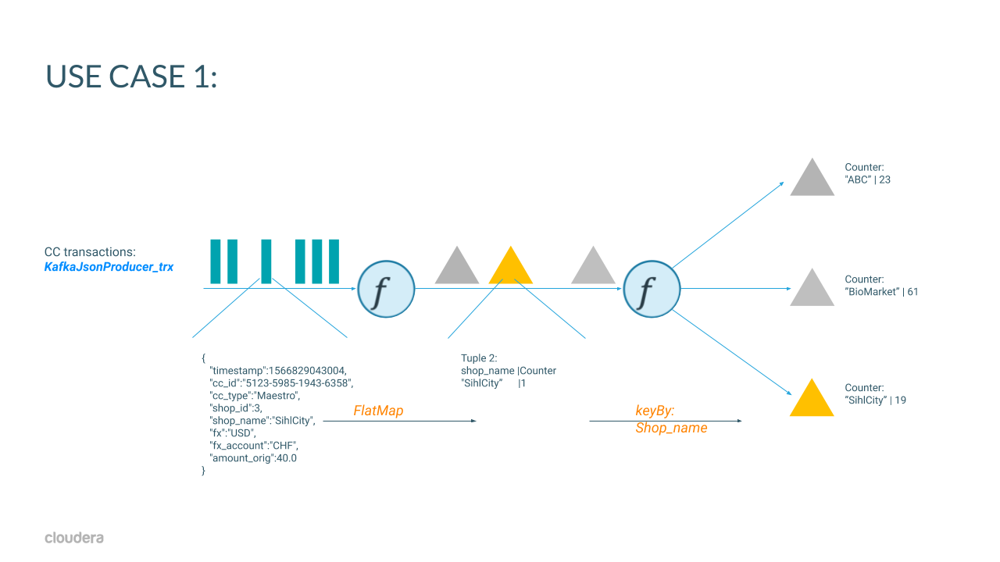
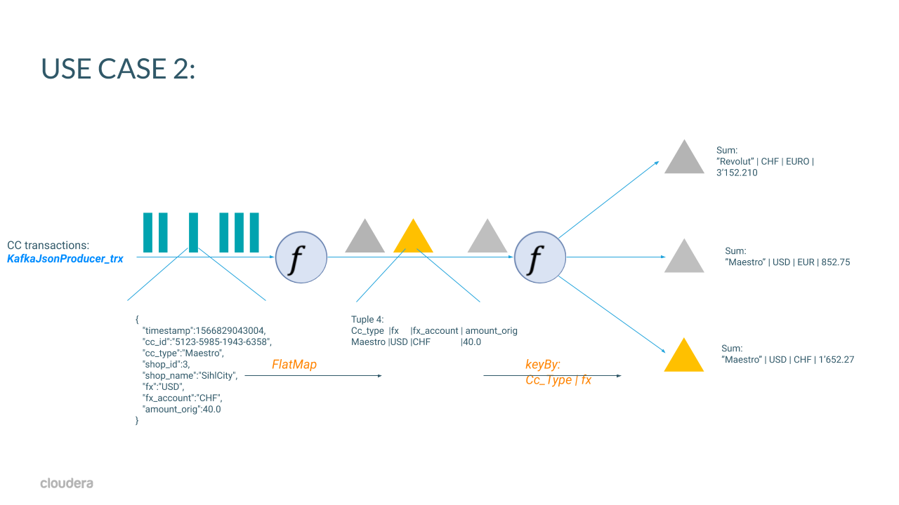
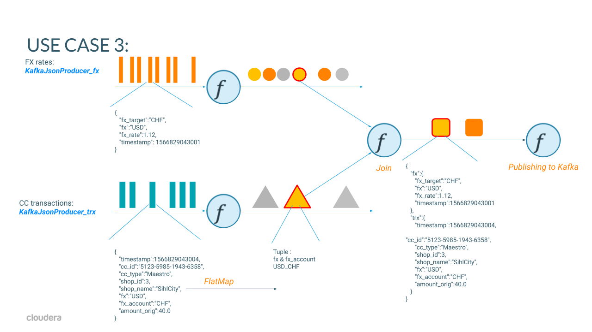
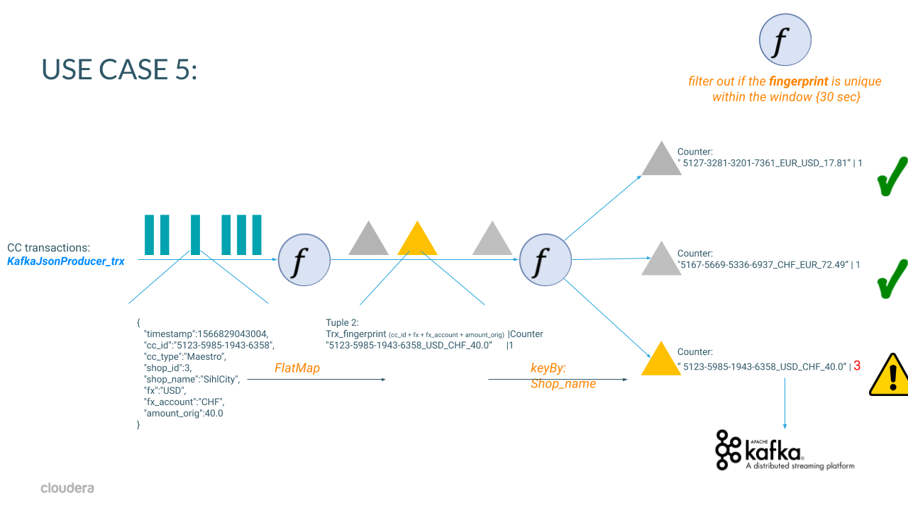
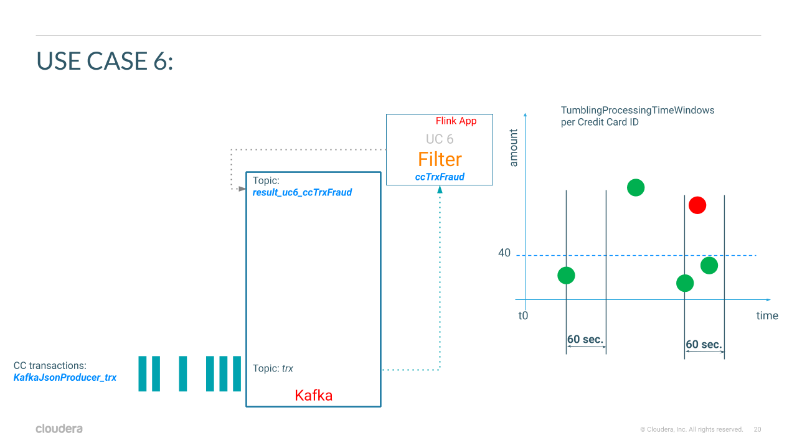
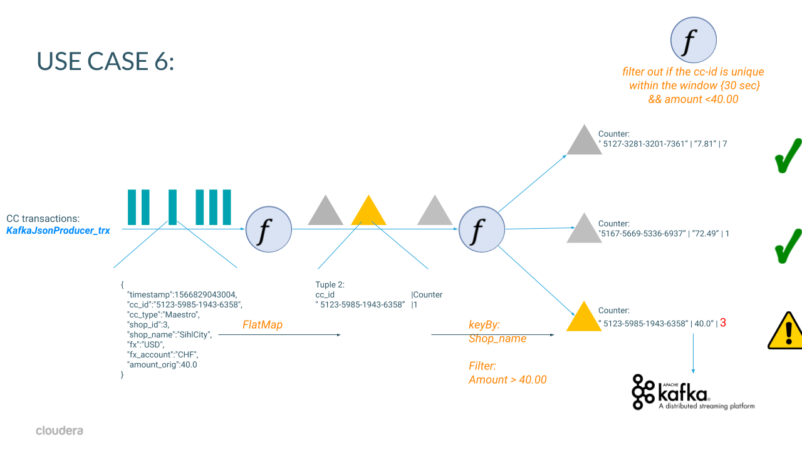
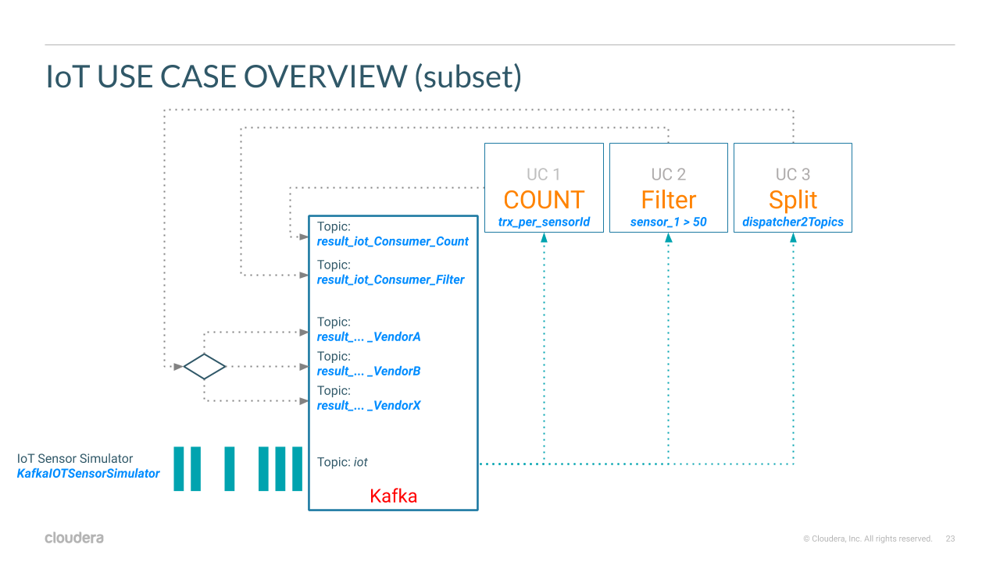

# Stateless Monitoring Application

## Table of contents
1. [Overview](#overview)
2. [Build](#build)
3. [Application logic](#concept)
4. [Execution](#run)


## Overview
The purpose of the Stateless Monitoring Application tutorial is to provide a self-contained boilerplate code example for a Flink application. You can use this simple tutorial for learning the basics of developing a Flink streaming application.

The application demonstrates basic capabilities of the DataStream API and shares best practices for testing and logging.

By the end of the tutorial, you will be able to:
1. Write and deploy a Flink application
2. Test a Flink application
3. Interact with the Flink logging framework


## Build
Before you start the tutorial, check out the repository and build the artifacts:
```
git clone https://github.com/zBrainiac/streaming-flink.git
cd streaming-flink
mvn clean package
```

## Concept:  
Presentation of streaming applications based on credit card transactions and FX rate stream

  
### FSI Use cases:  
#### Use case 1 - "count"
Start small - counting transactions per shop (group by) 


 
class: KafkaCount_trx_per_shop  
```
DataStream <Tuple2<String, Integer>> aggStream = trxStream
    .flatMap(new trxJSONDeserializer())
    // group by shop_name and sum their occurrences
    .keyBy(0)  // shop_name
    .sum(1);
```
JSON input stream:
```
{"timestamp":1566829043004,"cc_id":"5123-5985-1943-6358","cc_type":"Maestro","shop_id":3,"shop_name":"SihlCity","fx":"USD","fx_account":"CHF","amount_orig":40.0}
```

JSON output stream:
```
{"SihlCity":83}
```
  
#### Use case 2 - "sum"




class: KafkaSum_ccid_trx_fx  

```
DataStream <Tuple2<String, Integer>> aggStream = trxStream
    .flatMap(new trxJSONDeserializer())
    // group by "cc_id" AND "fx" and sum their occurrences
    .keyBy(0, 1)  // shop_name
    .sum(4);
```
JSON input stream:
```
{"timestamp":1566829043004,"cc_id":"5123-5985-1943-6358","cc_type":"Maestro","shop_id":3,"shop_name":"SihlCity","fx":"USD","fx_account":"CHF","amount_orig":40.0}
```

JSON output stream:
```
{"Maestro":"EUR":"USD":101.81}
```
  
#### Use case 3 - "merge two streams"
Merge two data steams - trx with the latest fx rate:  



JSON input stream:
```
Credit Card Trx: {"timestamp":1566829043004,"cc_id":"5123-5985-1943-6358","cc_type":"Maestro","shop_id":3,"shop_name":"SihlCity","fx":"USD","fx_account":"CHF","amount_orig":40.0}
FX: {"timestamp":1566829830600,"fx":"USD","fx_target":"CHF","fx_rate":1.03}
```


Merged result:
```
{
   "fx":{
      "fx_target":"CHF",
      "fx":"USD",
      "fx_rate":1.03,
      "timestamp":1566829830600
   },
   "trx":{
      "cc_type":"SihlCity",
      "shop_id":2,
      "fx":"USD",
      "amount_orig":40.00,
      "fx_account":"CHF",
      "cc_id":"5123-5985-1943-6358",
      "shop_name":"SihlCity",
      "timestamp":1566829043004
   }
}
```
 
 #### Use case 5 - "check on duplicated cc trx within in a window"  
 build fingerprint of the "cc transaction" stream, keep fingerprint in a window for {30 sec}.  
 filter out if the fingerprint is unique within the window - if the fingerprint occurs several times send alarm event  
 


 JSON input stream:
 ```
 {"timestamp":1566829043004,"cc_id":"5123-5985-1943-6358","cc_type":"Maestro","shop_id":3,"shop_name":"SihlCity","fx":"USD","fx_account":"CHF","amount_orig":40.0}
 ```
 
 Alarm in case of a duplicated cc trx  
  ```
 {"5125-6782-8503-3405"_"CHF"_"CHF"_54.8:2}
 ```
 
#### Use case 6 - "check on fraud"  
Keep "cc_id" in a window for {30 sec} and count transaction >= 40.00  
Filter out if the "cc_id" is unique within the window - if  not send alarm event  

  
  
Flink Flow:  



JSON input stream:
```
{"timestamp":1566829043004,"cc_id":"5123-5985-1943-6358","cc_type":"Maestro","shop_id":3,"shop_name":"SihlCity","fx":"USD","fx_account":"CHF","amount_orig":40.0}
```
  
Alarm in case of a duplicated cc trx  
```
{"5155-9621-5112-8965":6}
```

### IoT Use cases:  

overview of all IoT use cases:

 `

 
## run:
### Requirements:  
- local installation of the latest Apache Kafka (e.g. on infra/kafka_2.12-2.4.1)
- up-to-date IDE such as Intellij IDEA

### Kafka Environment:  
```
cd infra/kafka_2.12-2.4.1  
bin/zookeeper-server-start.sh config/zookeeper.properties  
bin/kafka-server-start.sh config/server.properties  


./bin/kafka-topics.sh --create --bootstrap-server localhost:9092 --replication-factor 1 --partitions 1 --topic trx &&  
./bin/kafka-topics.sh --create --bootstrap-server localhost:9092 --replication-factor 1 --partitions 1 --topic fx &&  
./bin/kafka-topics.sh --list --bootstrap-server localhost:9092 &&  
./bin/kafka-console-consumer.sh --bootstrap-server localhost:9092 --topic trx
./bin/kafka-console-consumer.sh --bootstrap-server localhost:9092 --topic fx
./bin/kafka-console-consumer.sh --bootstrap-server localhost:9092 --topic topic1
```

### Local execution Environment:  
```
cd streaming-flink 
java -classpath target/streaming-flink-0.1-SNAPSHOT.jar producer.KafkaIOTSensorSimulator
java -classpath target/streaming-flink-0.1-SNAPSHOT.jar consumer.IoTConsumerCount  
java -classpath target/streaming-flink-0.1-SNAPSHOT.jar consumer.IoTConsumerFilter
java -classpath target/streaming-flink-0.1-SNAPSHOT.jar consumer.IoTConsumerSplitter
```

### Download release:  
cd /opt/cloudera/parcels/FLINK  
sudo wget https://github.com/zBrainiac/streaming-flink/releases/download/0.1.3/streaming-flink-0.1-SNAPSHOT.jar -P /opt/cloudera/parcels/FLINK/lib/flink/examples/streaming

### Upload release: 
scp -i field.pem GoogleDrive/workspace/streaming-flink/target/streaming-flink-0.1-SNAPSHOT.jar centos@52.59.200.19:/tmp  
sudo cp /tmp/streaming-flink-0.1-SNAPSHOT.jar /opt/cloudera/parcels/FLINK/lib/flink/examples/streaming 


## Test data gen:
### TRX
cd /opt/cloudera/parcels/FLINK/lib/flink/examples/streaming  
java -classpath streaming-flink-0.1-SNAPSHOT.jar producer.KafkaJsonProducer_trx or  
java -classpath streaming-flink-0.1-SNAPSHOT.jar producer.KafkaJsonProducer_trx localhost:9092 10 (= 10 sleep time in ms between the messages | default 1'000 ms)  
java -classpath streaming-flink-0.1-SNAPSHOT.jar producer.KafkaJsonProducer_trx edge2ai-1.dim.local:9092
```
sample trx json:
{"timestamp":1565604610745,"shop_id":4,"shop_name":"Ums Eck","cc_type":"Visa","cc_id":"cc_id":"5130-2220-4900-6727","amount_orig":86.82,"fx":"EUR","fx_account":"CHF"}
```   
### FX
cd /opt/cloudera/parcels/FLINK/lib/flink/examples/streaming  
java -classpath streaming-flink-0.1-SNAPSHOT.jar producer.KafkaJsonProducer_fx or  
java -classpath streaming-flink-0.1-SNAPSHOT.jar producer.KafkaJsonProducer_fx localhost:9092 10 (= 10 sleep time in ms between the messages | default 1'000 ms)  
java -classpath streaming-flink-0.1-SNAPSHOT.jar producer.KafkaJsonProducer_fx edge2ai-1.dim.local:9092
```  
sample fx json:
{"timestamp":1565604610729,"fx":"EUR","fx_rate":0.91}
```
### IOT Sensor
cd /opt/cloudera/parcels/FLINK/lib/flink/examples/streaming  
java -classpath streaming-flink-0.1-SNAPSHOT.jar producer.KafkaIOTSensorSimulator or  
java -classpath streaming-flink-0.1-SNAPSHOT.jar producer.KafkaIOTSensorSimulator localhost:9092 10 (= 10 sleep time in ms between the messages | default 1'000 ms)  
java -classpath streaming-flink-0.1-SNAPSHOT.jar producer.KafkaIOTSensorSimulator edge2ai-1.dim.local:9092                           
```  
sample iot json:
{"sensor_ts":1588330712878,"sensor_id":1,"sensor_0":88,"sensor_1":93,"sensor_2":31,"sensor_3":90,"sensor_4":75,"sensor_5":74,"sensor_6":58,"sensor_7":91,"sensor_8":10,"sensor_9":21,"sensor_10":66,"sensor_11":40}
```

### IOT Simple CSV generator
cd /opt/cloudera/parcels/FLINK/lib/flink/examples/streaming  
java -classpath streaming-flink-0.1-SNAPSHOT.jar producer.KafkaIOTSimpleCSVProducer or  
java -classpath streaming-flink-0.1-SNAPSHOT.jar producer.KafkaIOTSimpleCSVProducer localhost:9092 10 (= 10 sleep time in ms between the messages | default 1'000 ms)  
java -classpath streaming-flink-0.1-SNAPSHOT.jar producer.KafkaIOTSimpleCSVProducer edge2ai-1.dim.local:9092  
```  
sample CSV message:
1596953344830, 10, 9d02e657-80c9-4857-b18b-26b58f09ae6c, Test Message #25
```  

### IOT Simple KV generator
cd /opt/cloudera/parcels/FLINK/lib/flink/examples/streaming  
java -classpath streaming-flink-0.1-SNAPSHOT.jar producer.KafkaIOTSimpleKVProducer or  
java -classpath streaming-flink-0.1-SNAPSHOT.jar producer.KafkaIOTSimpleKVProducer localhost:9092 10 (= 10 sleep time in ms between the messages | default 1'000 ms)  
java -classpath streaming-flink-0.1-SNAPSHOT.jar producer.KafkaIOTSimpleKVProducer edge2ai-1.dim.local:9092  
```  
sample KeyValue message:
unixTime: 1596953939783, sensor_id: 1, id: ba292ff6-e4db-4776-b70e-2b49edfb6726, Test Message: bliblablub #33
```  

### OPC Sensor
cd /opt/cloudera/parcels/FLINK/lib/flink/examples/streaming  
java -classpath streaming-flink-0.1-SNAPSHOT.jar producer.KafkaOPCSimulator or  
java -classpath streaming-flink-0.1-SNAPSHOT.jar producer.KafkaOPCSimulator localhost:9092 10 (= 10 sleep time in ms between the messages | default 1'000 ms)  
java -classpath streaming-flink-0.1-SNAPSHOT.jar producer.KafkaOPCSimulator edge2ai-1.dim.local:9092
```  
sample opc json:
{"__time":"2020-05-01T11:01:04.818786Z","tagname":"Triangle4711","unit":"Hydrocracker","value":0.96354}
```  

### OPC Sensor
cd /opt/cloudera/parcels/FLINK/lib/flink/examples/streaming  
java -classpath streaming-flink-0.1-SNAPSHOT.jar producer.KafkaTrafficCollector or  
java -classpath streaming-flink-0.1-SNAPSHOT.jar producer.KafkaTrafficCollector localhost:9092 10 (= 10 sleep time in ms between the messages | default 1'000 ms)  
java -classpath streaming-flink-0.1-SNAPSHOT.jar producer.KafkaTrafficCollector edge2ai-1.dim.local:9092
```  
sample opc json:
{"sensor_ts":1596952894254,"sensor_id":2,"probability":96,"sensor_x":76,"typ":"LKW","light":false,"license_plate":"AT 448-3946"}
{"sensor_ts":1596952895018,"sensor_id":10,"probability":52,"sensor_x":14,"typ":"Bike"}
```  

### douple check kafka topic
cd /opt/cloudera/parcels/CDH
./bin/kafka-topics --list --bootstrap-server edge2ai-1.dim.local:9092
./bin/kafka-console-consumer --bootstrap-server edge2ai-1.dim.local:9092 --topic result_iot_Consumer_Count


## Run Flink Apps on yarn cluster:  
cd /opt/cloudera/parcels/FLINK  

### iot
./bin/flink run -m yarn-cluster -c consumer.IoTConsumerCount -ynm IoTConsumerCount lib/flink/examples/streaming/streaming-flink-0.1-SNAPSHOT.jar edge2ai-1.dim.local:9092  
./bin/flink run -m yarn-cluster -c consumer.IoTConsumerFilter -ynm IoTConsumerFilter lib/flink/examples/streaming/streaming-flink-0.1-SNAPSHOT.jar edge2ai-1.dim.local:9092  
./bin/flink run -m yarn-cluster -c consumer.IoTConsumerSplitter -ynm IoTConsumerSplitter lib/flink/examples/streaming/streaming-flink-0.1-SNAPSHOT.jar edge2ai-1.dim.local:9092  

### OPC
./bin/flink run -m yarn-cluster -c consumer.OPCNoiseCanceller -ynm OPCNoiseCanceller lib/flink/examples/streaming/streaming-flink-0.1-SNAPSHOT.jar edge2ai-1.dim.local:9092  

### FSI
./bin/flink run -m yarn-cluster -c consumer.UC1KafkaCountTrxPerShop -ynm UC1KafkaCountTrxPerShop lib/flink/examples/streaming/streaming-flink-0.1-SNAPSHOT.jar edge2ai-1.dim.local:9092  
./bin/flink run -m yarn-cluster -c consumer.UC2KafkaSumccTypTrxFx -ynm UC2KafkaSumccTypTrxFx lib/flink/examples/streaming/streaming-flink-0.1-SNAPSHOT.jar edge2ai-1.dim.local:9092  
./bin/flink run -m yarn-cluster -c consumer.UC3KafkaJoin2JsonStreams -ynm UC3KafkaJoin2JsonStreams lib/flink/examples/streaming/streaming-flink-0.1-SNAPSHOT.jar  edge2ai-1.dim.local:9092  
./bin/flink run -m yarn-cluster -c consumer.UC5KafkaTrxDuplicateChecker -ynm UC5KafkaTrxDuplicateChecker lib/flink/examples/streaming/streaming-flink-0.1-SNAPSHOT.jar edge2ai-1.dim.local:9092  
./bin/flink run -m yarn-cluster -c consumer.UC6KafkaccTrxFraud -ynm UC6KafkaccTrxFraud lib/flink/examples/streaming/streaming-flink-0.1-SNAPSHOT.jar edge2ai-1.dim.local:9092  
./bin/flink run -m yarn-cluster -c consumer.UC7KafkaAvgFx -ynm UC7KafkaAvgFx lib/flink/examples/streaming/streaming-flink-0.1-SNAPSHOT.jar edge2ai-1.dim.local:9092  


## Run Atlas sync:
cd /opt/cloudera/parcels/CDH/lib/atlas/hook-bin  
./import-kafka.sh 