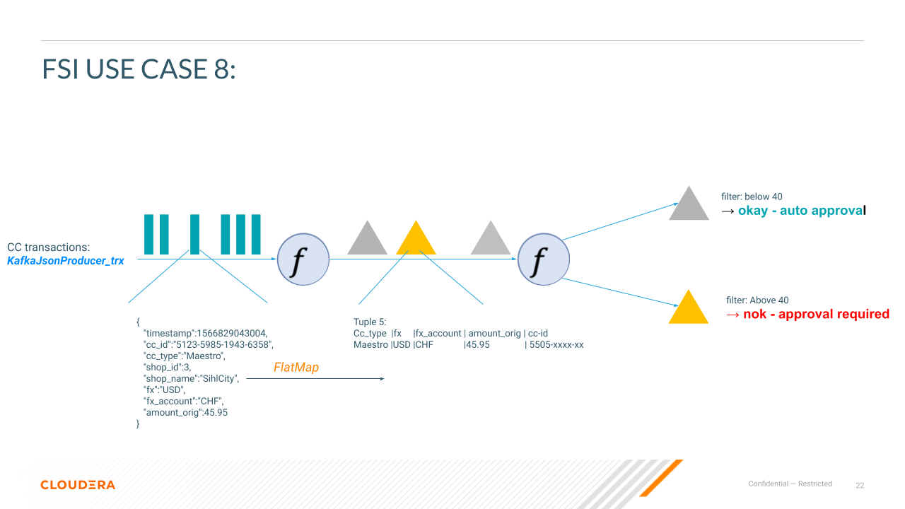
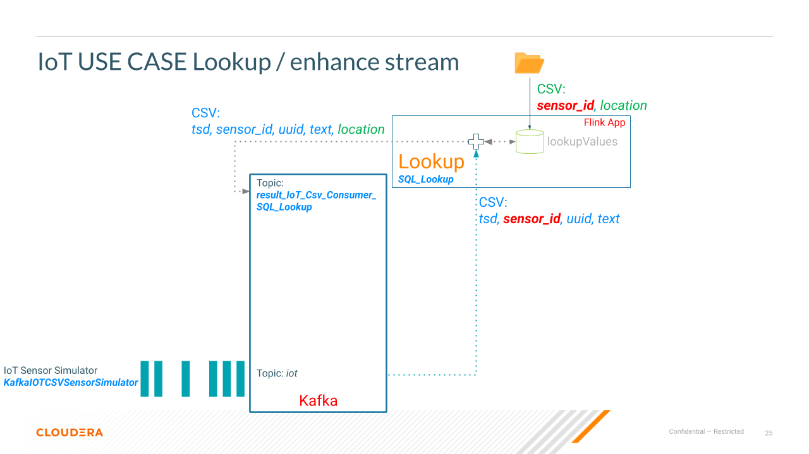
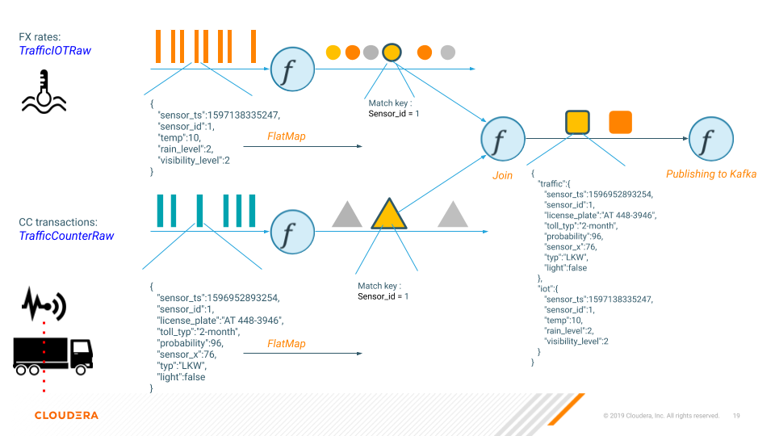

# Stateless Monitoring Application

## Table of contents
1. [Overview](#overview)
2. [Build](#build)
3. [Application logic](#concept)  
3.1. [FSI Use cases](#FSI_Use_cases)  
3.2. [IoT Use cases](#IoT_Use_cases)  
3.3. [Traffic Use cases](#Traffic_Use_cases)  
4. [Execution](RUN.md)
5. Show Cases
5.1. [Traffic](showcase/traffic/ShowCase_Traffic.md)


## Overview
The purpose of the Stateless Monitoring Application tutorial is to provide a self-contained boilerplate code example for a Flink application. You can use this simple tutorial for learning the basics of developing a Flink streaming application.

The application demonstrates basic capabilities of the DataStream API and shares best practices for testing and logging.

By the end of the tutorial, you will be able to:
1. Write and deploy a Flink application
2. Test a Flink application
3. Interact with the Flink logging framework


## Build
Before you start the tutorial, check out the repository and build the artifacts:
```
git clone https://github.com/zBrainiac/streaming-flink.git
cd streaming-flink
mvn clean package
```

## Concept:  
Presentation of streaming applications based on credit card transactions and FX rate stream

  
### FSI_Use_cases:  
#### Use case 1 - "count"
Start small - counting transactions per shop (group by) 


 
class: KafkaCount_trx_per_shop  
```
DataStream <Tuple2<String, Integer>> aggStream = trxStream
    .flatMap(new trxJSONDeserializer())
    // group by shop_name and sum their occurrences
    .keyBy(0)  // shop_name
    .sum(1);
```
JSON input stream:
```
{"timestamp":1566829043004,"cc_id":"5123-5985-1943-6358","cc_type":"Maestro","shop_id":3,"shop_name":"SihlCity","fx":"USD","fx_account":"CHF","amount_orig":40.0}
```

JSON output stream:
```
{"SihlCity":83}
```
  
#### Use case 2 - "sum"


class: KafkaSum_ccid_trx_fx  

```
DataStream <Tuple2<String, Integer>> aggStream = trxStream
    .flatMap(new trxJSONDeserializer())
    // group by "cc_id" AND "fx" and sum their occurrences
    .keyBy(0, 1)  // shop_name
    .sum(4);
```
JSON input stream:
```
{"timestamp":1566829043004,"cc_id":"5123-5985-1943-6358","cc_type":"Maestro","shop_id":3,"shop_name":"SihlCity","fx":"USD","fx_account":"CHF","amount_orig":40.0}
```

JSON output stream:
```
{"Maestro":"EUR":"USD":101.81}
```
  
#### Use case 3 - "merge two streams"
Merge two data steams - trx with the latest fx rate:  


JSON input stream:
```
Credit Card Trx: {"timestamp":1566829043004,"cc_id":"5123-5985-1943-6358","cc_type":"Maestro","shop_id":3,"shop_name":"SihlCity","fx":"USD","fx_account":"CHF","amount_orig":40.0}
FX: {"timestamp":1566829830600,"fx":"USD","fx_target":"CHF","fx_rate":1.03}
```


Merged result:
```
{
   "fx":{
      "fx_target":"CHF",
      "fx":"USD",
      "fx_rate":1.03,
      "timestamp":1566829830600
   },
   "trx":{
      "cc_type":"SihlCity",
      "shop_id":2,
      "fx":"USD",
      "amount_orig":40.00,
      "fx_account":"CHF",
      "cc_id":"5123-5985-1943-6358",
      "shop_name":"SihlCity",
      "timestamp":1566829043004
   }
}
```
 
 #### Use case 5 - "check on duplicated cc trx within in a window"  
 build fingerprint of the "cc transaction" stream, keep fingerprint in a window for {30 sec}.  
 filter out if the fingerprint is unique within the window - if the fingerprint occurs several times send alarm event  
 


 JSON input stream:
 ```
 {"timestamp":1566829043004,"cc_id":"5123-5985-1943-6358","cc_type":"Maestro","shop_id":3,"shop_name":"SihlCity","fx":"USD","fx_account":"CHF","amount_orig":40.0}
 ```
 
 Alarm in case of a duplicated cc trx  
  ```
 {"5125-6782-8503-3405"_"CHF"_"CHF"_54.8:2}
 ```
 
#### Use case 6 - "check on fraud"  
Keep "cc_id" in a window for {30 sec} and count transaction >= 40.00  
Filter out if the "cc_id" is unique within the window - if  not send alarm event  

  
  
Flink Flow:  


JSON input stream:
```
{"timestamp":1566829043004,"cc_id":"5123-5985-1943-6358","cc_type":"Maestro","shop_id":3,"shop_name":"SihlCity","fx":"USD","fx_account":"CHF","amount_orig":40.0}
```
  
Alarm in case of a duplicated cc trx  
```
{"5155-9621-5112-8965":6}
```

#### Use case 8 - "dispatch Credit Card transactions for approval"  
Send credit card transactions above 40.00 to approval topic
  
Flink Flow:  



JSON input stream:
```
{"timestamp":1566829043004,"cc_id":"5123-5985-1943-6358","cc_type":"Maestro","shop_id":3,"shop_name":"SihlCity","fx":"USD","fx_account":"CHF","amount_orig":40.0}
```
  
okay case: amount below 40 - auto approval
```
{"type":"okay","subtype":"auto approval - amount below 40","credit cart id":"5171-9364-9817-2054","credit cart issuer":"USD","original amount":47.17}
```

nok case: amount above 40 - approval required
```
{"type":"nok","subtype":"verification required - amount above 40","credit cart id":"5126-7561-2004-4916","credit cart issuer":"EUR","original amount":85.78}
```

### IoT_Use_cases:  

overview of all IoT use cases:


Use Case enhance stream / Lookup CSV:
- IoTCsvConsumerSQLLookupCSV
- IoTCsvConsumerSQLLookupJSON



CSV input stream:
```
1598101297091, 1, 16bc7e63-95bc-424b-a5d5-69b5bee9644e, Test Message #1186
```
lookup CSV File --> lookup table:
```
sensorid, location
0, City Zürich,
1, City Amsterdam,
2, City Berlin,
3, City Cambera,
```

CSV Output stream:
```
1598101297091, 1, 16bc7e63-95bc-424b-a5d5-69b5bee9644e, Test Message #1186, City Amsterdam
```

JSON Output stream:
```
{"type":"ok","subtype":"message enrichment","sensor_ts":1598263121787,"uuid":"8ef8f0d9-af5e-45c2-8f5f-af7844423849","sensor_id":6,"message":"Test Message #2076","location":"City Florenz"}
```

### Traffic_Use_cases:  
#### Use case 5 - "join"


